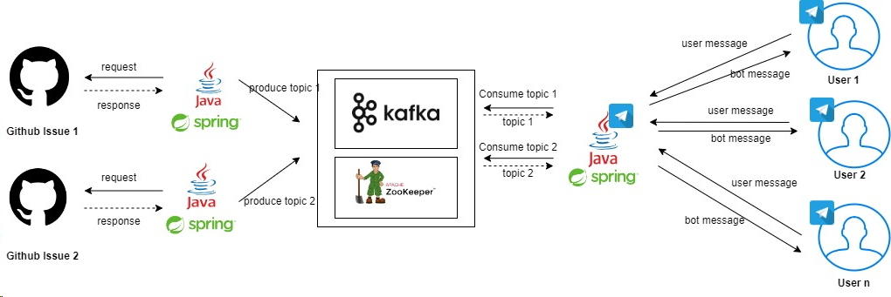

# ***REAL-TIME GITHUB ISSUES PROCESSOR***
The project is created through SpringBoot applications along with Apache Kafka for managing all the GitHub issues produced in different repositories and then send the issues to the consumer using telegram bot.  
Status:**COMPLETED**
--------------------------------------------------------------------
### *REAL-TIME PROGRAMMING*  
NAME:_CHONG LI XIANG_ 
MATRICNo:_284645_  

##### CLASSES LISTED
| NO | CLASSES                |
|----|------------------------|
| 1  | BotState               |
| 2  | CommentService         |
| 3  | Constants              |
| 4  | GithubContent          |
| 5  | GitHubIssueController1 |
| 6  | GitHubIssueController2 |
| 7  | JsonExample            |
| 8  | KafkaConsumerConfig    |
| 9  | KafkaConsumerExample   |
| 10 | KafkaProducerConfig1   |
| 11 | KafkaProducerConfig2   |
| 12 | KeyboardFactory        |
| 13 | MessageConsumer1       |
| 14 | MessageConsumer2       |
| 15 | MessageProducer        |
| 16 | ResponseHandlers       |
| 17 | RestTemplateConfig     |
| 18 | SharingFactory         |
| 19 | SpringBootApplications |
| 20 | TelegramBot            |
| 21 | WebhookController1     |
| 22 | WebhookController2     |

 

##### SYSTEM ARCHITECTURE

 

##### JAVADOC
[JAVADOC.zip](JAVADOC)

------------------------------------------------------------------------------------------------------------------
* [CLICK HERE TO GO BACK](https://github.com/MchalxZ)
